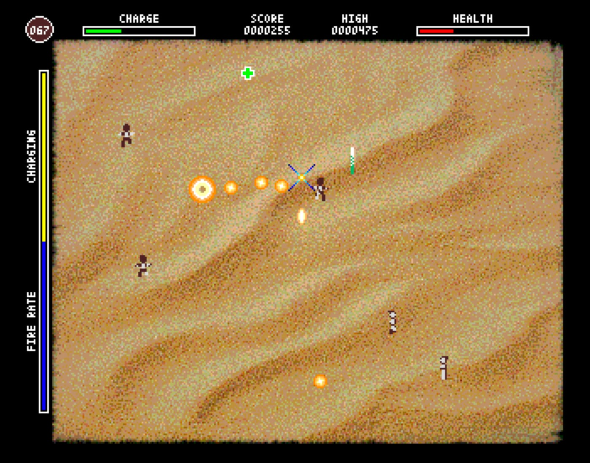

# Operation Jeff

A simple arcade game for the ZX Spectrum Next - Work in progress!

The code can be compiled with `make` and the z88dk toolchain. It is developed using Visual Studio Code.

More details will be added here soon.

### Instructions

Use the mouse to point and shoot. The bolts you fire land and explode shortly later, and will dematerialise any nearby Jeff.

Do not let any Jeff reach the edge of the screen, or you will lose health and eventually the game will be over. Once a certain number of Jeff is eliminated, you move onto the next area.

Shooting uses _charge_ which slowly replenishes over time. You can trade fire rate for charge speed (and the reverse) by using the mouse wheel.

Shoot bonuses for various benefits:
- Red cross: Replenish health
- Green cross: Replenish charge
- Black cross: Bonus points
- Yellow diamond: Smart bomb
- Blue clock: Freeze the Jeff for 5 seconds

If a bolt explodes especially close enough to a Jeff you get a small bonus as well.

Press P to pause during the game.

|||
|--|--|

|||||
|--|--|--|--|
|||||

### Resources

The game packs all its resources into a single NEX file. Almost all data, except the executable code and digial audio, is compressed using the zx0 compressor and decompressed at the time of use.

The resources are converted to native Next formats from the files in `resources_original` via the `convertResource.sh` script.

Level heightmaps are converted via the `convertHeightmaps.swift` script.

The converted assets are then scanned by the `makeAssets.swift` script which results in a generated `assets.asm` file with an accompanying `assets.h` file. The ASM file builds the binary blob with all the binary data, sorted to fill each memory page as much as possible, and the H file creates defines which are used in the game to refer to each resource's (paged-in) address, data length, and page.

### Memory map

Like most z80 targetting software, the code makes heavy use of paging. This diagram may help make code and memory setup more understandable. The main strategy is:

#### The low 16k (`MMU0` and `MMU1`)

The ROM is configured as `ROM3`, which is the traditional 48k Sinclair ZX Spectrum ROM and is required by the ESX Dos API. However outside of making ESX Dos API calls, _the ROM is usually paged-out_. Instead the layout of the bottom 16k is this:

- `MMU0` is read-only and set to page 28, containing the ISR routine, and most constant values used in the program.
- `MMU1` is also read-only and mostly used for loading and buffering read-only things, like the compressed contents of levels.
- `MMU0` and `MMU1` are configured as write-only for writing to the Layer 2 display in 16k chunks.

#### The next 16k (`MMU2` and `MMU3`)

- `MMU2` is either (a) used as an extension for 16k-size buffers starting at `MMU1`, like when loading sprites, playing audio loops, or (b) as a read/write buffer for data when we're decompressing zx0 data such as screens.
- `MMU3` would traditionally point to the tilemap on the ZX Spectrum Next, but most of the time we point it to page 10, which is to where the ULA has been relocated. The game can flip between the two when required to modify each one.
- `MMU3` Acts as secondary buffer as well, currently used when loading palettes. This secondary buffer is used when playing sampled sound from the "main" buffer area at `MMU1` and `MMU2`.

#### The top 32k (`MMU4` -> `MMU7`)

- `MMU4` to `MMU7` hold the executable code and read/write variables, buffers, etc.
- The stack grows back from the end at $FFFF.

*All code (c) 2025 Paul Tsochantaris, published under the MIT license.*
